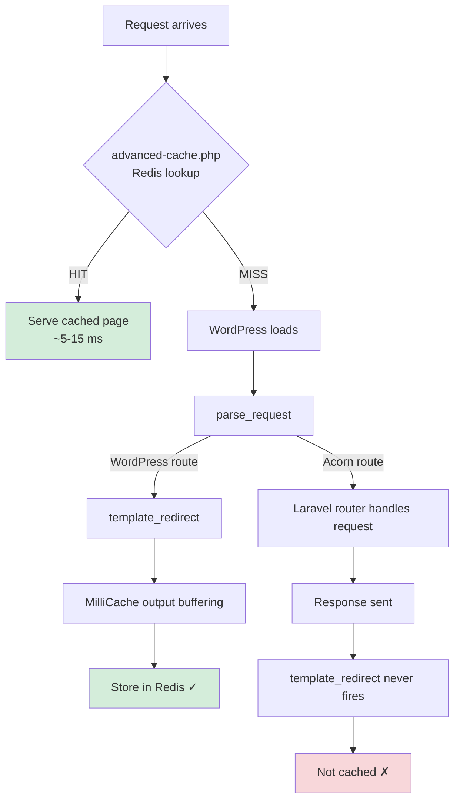
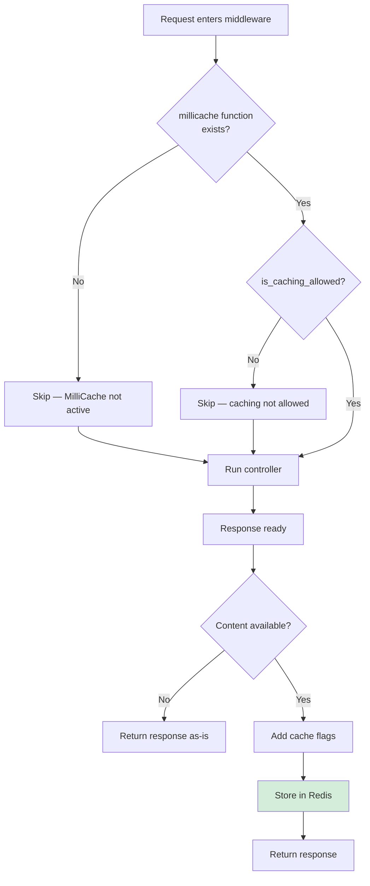
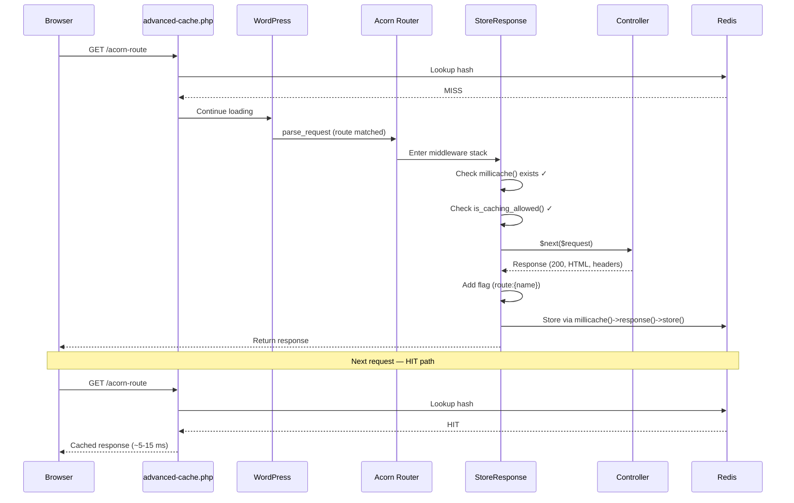

# How It Works

This page explains the caching gap that Acorn MilliCache fills, how the `StoreResponse` middleware pipeline works, and how cached responses are served.

## The Caching Gap

MilliCache's standard caching flow works like this:

1. A request arrives → `advanced-cache.php` checks Redis for a cached response
2. On **HIT** → the cached page is served immediately (WordPress never loads)
3. On **MISS** → WordPress loads, MilliCache hooks `template_redirect` to start output buffering, and the finished response is stored in Redis

**The problem:** Acorn custom routes are resolved during `parse_request` and send their response directly — *before* WordPress reaches `template_redirect`. MilliCache's output-buffering hook never fires, so Acorn route responses are never cached.



## How StoreResponse Fills the Gap

The `StoreResponse` middleware runs inside Acorn's Laravel router — exactly where WordPress hooks cannot reach. It captures the finished response and stores it in Redis using MilliCache's own API.

### Middleware Pipeline



The middleware follows this sequence:

1. **Check MilliCache is active** — `function_exists('millicache')`. If MilliCache isn't loaded (e.g. deactivated), the middleware becomes a no-op.
2. **Check caching is allowed** — `millicache()->options()->is_caching_allowed()`. This respects all of MilliCache's conditions (logged-in users, excluded URLs, POST requests, etc.).
3. **Run the controller** — `$next($request)` passes the request down the middleware stack to your controller, which returns a response.
4. **Capture the response** — the middleware reads the response content, headers, and status code.
5. **Add cache flags** — adds a `route:{name}` flag for named routes, or a bare `route` flag for unnamed routes (see [Cache Flags](#cache-flags) below).
6. **Store in Redis** — delegates to `millicache()->response()->store()`, which handles hash generation, flag collection, compression, and writing the cache entry.

> [!IMPORTANT]
> The caching decision (`is_caching_allowed()`) is made **before** the controller runs. This means no unnecessary storage work happens for requests that should not be cached.

## What Gets Stored

The middleware passes these values to MilliCache's `ResponseProcessor`:

| Value       | Source                         | Description                          |
|-------------|--------------------------------|--------------------------------------|
| Content     | `$response->getContent()`      | The full response body               |
| Headers     | `$response->headers->all()`    | All response headers in `Key: Value` format |
| Status code | `$response->getStatusCode()`   | HTTP status code (e.g. `200`)        |
| TTL         | `millicache()->options()->get_ttl()`   | Cache lifetime from MilliCache config |
| Grace       | `millicache()->options()->get_grace()` | Stale-while-revalidate grace period  |

> [!NOTE]
> MilliCache's `Writer::validate_headers()` automatically filters out `Set-Cookie` and `X-MilliCache-*` headers before writing. The middleware does not need to handle this.

## Cache Flags

MilliCache uses [cache flags](https://millipress.com/docs/millicache/cache-flags/) for targeted invalidation — e.g. purging all entries tagged with a specific flag. For WordPress pages, MilliCache automatically adds flags like `post:123` or `archive:category:5` via its `RequestFlags` rules. Since Acorn routes bypass that hook, this package adds its own flags before storing.

### Automatic Flags

The middleware adds a cache flag based on the route name:

| Route | Flag | Example |
|-------|------|---------|
| Named | `route:{name}` | `route:products:index` |
| Unnamed | `route` | `route` |

The Laravel route name is converted from dots to colons to match MilliCache's flag convention (`products.index` → `route:products:index`). Unnamed routes receive a bare `route` fallback flag.

In addition, MilliCache automatically adds a `url:{hash}` flag for every cache entry (both WordPress and Acorn).

Use the `route*` wildcard to target all Acorn route caches at once, or a specific flag like `route:products:index` for targeted invalidation.

> [!TIP]
> Naming your routes gives you granular cache invalidation for free. Unnamed routes can only be cleared in bulk via `route*` or individually via their `url:{hash}`.

### Custom Flags

You can add custom flags to Acorn route cache entries using [Acorn MilliRules](https://millipress.com/docs/acorn-millirules/). Define a rule with an `add_flag` action that targets your route by name, controller, or any other condition.

## Cache Clearing

### WP-CLI

MilliCache provides WP-CLI commands for cache management. These work for all cached entries, including Acorn routes:

```bash
# Clear all cached pages
wp millicache clear

# Clear all Acorn route caches
wp millicache clear --flag=route*

# Clear a specific route's cache
wp millicache clear --flag=route:products:index
```

See the [MilliCache WP-CLI documentation](https://millipress.com/docs/millicache/wp-cli/) for the full command reference.

### Automatic Clearing

Acorn MilliCache automatically clears cache entries when certain Artisan commands run. The mapping between commands and flag patterns is [configurable](../02-configuration/01-configuration.md#automatic-cache-clearing):

```php
// config/millicache.php
'clear' => [
    'optimize:clear' => 'route*',
    'route:clear'    => 'route*',
    'route:cache'    => 'route*',
],
```

By default, `optimize:clear`, `route:clear`, and `route:cache` all clear Acorn route caches (`route*`). WordPress page caches are not affected.

> [!NOTE]
> For targeted clearing of a specific route's cache, use `wp millicache clear --flag=route:products:index` via WP-CLI.

## Cache Serving (HIT Path)

Once a response is stored, subsequent requests are served by MilliCache's `advanced-cache.php` drop-in. This runs *before* WordPress loads:

1. `advanced-cache.php` calculates the request hash
2. Looks up the hash in Redis
3. On **HIT** → sends the cached headers, status code, and body directly
4. WordPress, Acorn, and Laravel are never loaded (~5–15 ms response time)

This package has no role in the HIT path. It only handles MISS storage.

## Error Handling

Cache storage is wrapped in a `try/catch` block. If Redis is unavailable or any storage step fails:

- The original response is returned to the visitor **unchanged**
- The error is logged via `error_log()` with an `[acorn-millicache]` prefix
- No exception propagates to the user

> [!TIP]
> Cache failures are silent by design. A broken cache connection should degrade to uncached responses, never to error pages.

## Full Request Lifecycle



## Further Reading

- [MilliCache — How Caching Works](https://millipress.com/docs/millicache/how-it-works/) — the full cache lifecycle including output buffering, compression, and stale-while-revalidate
- [MilliCache — Configuration](https://millipress.com/docs/millicache/configuration/) — TTL, grace period, and other cache settings
- [Acorn MilliRules](https://millipress.com/docs/acorn-millirules/) — route-aware cache rules and conditions
